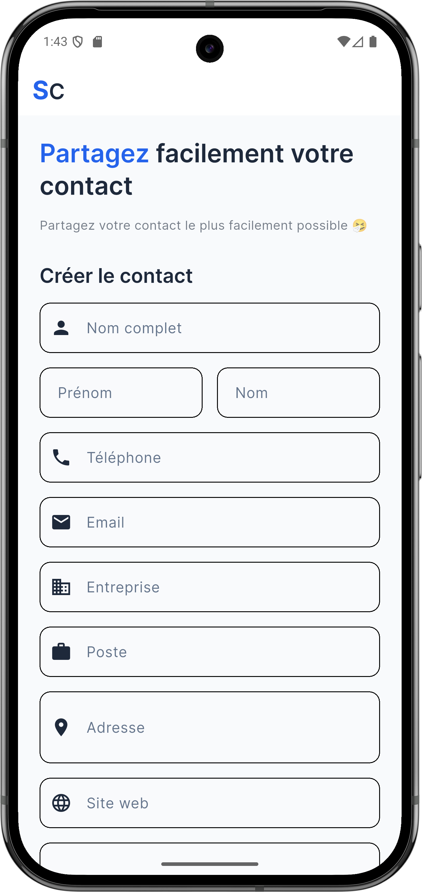
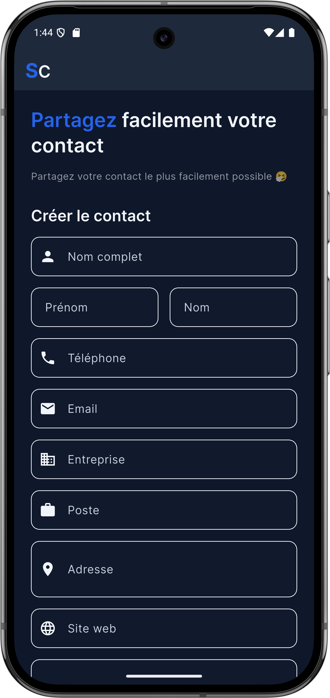
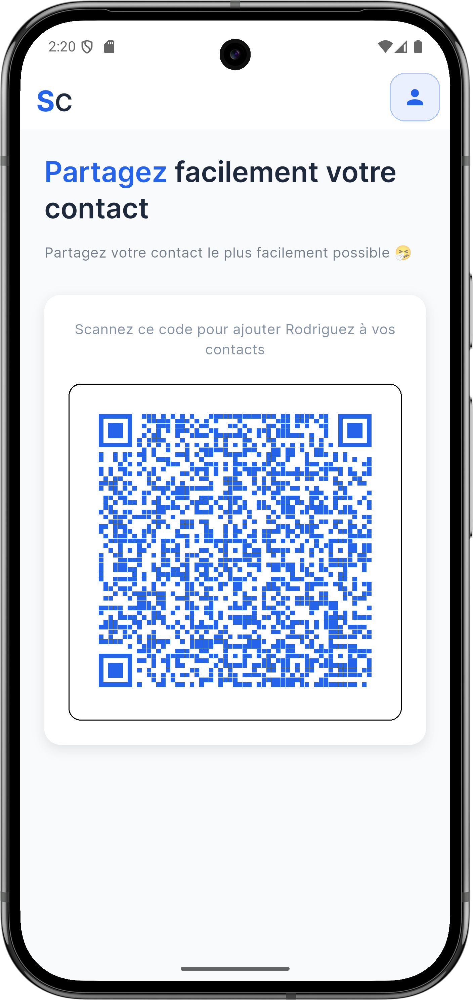
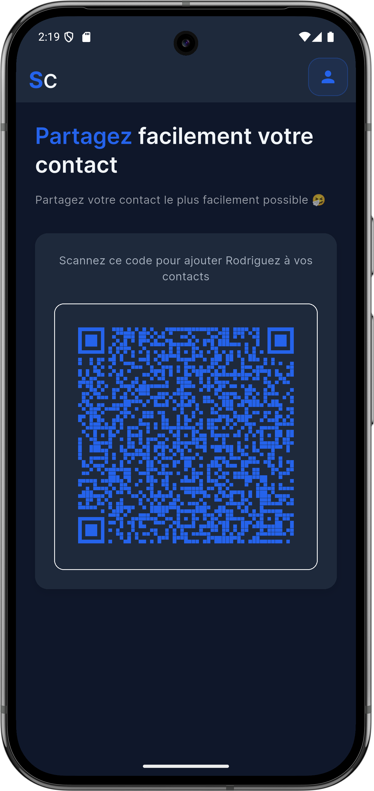

```markdown
# 🌟 S-Contact - QR Code Contact Sharing App

[](https://flutter.dev)
[](https://dart.dev)
[](https://opensource.org/licenses/MIT)
[](CONTRIBUTING.md)
[](https://hacktoberfest.com)
[](https://github.com/Rodrigue-k/s_contact)

<div align="center">
  <p><strong>Share your contact information instantly with beautiful QR codes! 📱✨</strong></p>
</div>

---

## 🚀 About S-Contact

S-Contact is an open-source Flutter application that allows users to create digital business cards and share their contact information through QR codes in vCard format. Perfect for networking events, business meetings, or making it easy for others to save your contact details! The app is **cross-platform (Android + iOS)**, with plans for desktop support, and emphasizes simplicity, security, and privacy: all data is stored locally, with no sensitive permissions required (e.g., no camera access).

**Project Name**: s_contact  
**Description**: A Flutter open-source app for sharing and saving contacts quickly via QR code, without external servers or complex APIs.

---

## 💡 Why It’s Awesome

* ✅ **No API Dependencies**: No need for Google or Apple API keys.
* ✅ **Cross-Platform**: Works on Android, iOS, and potentially desktop.
* ✅ **Maximum Security & Privacy**: Data stays local with `shared_preferences`.
* ✅ **Simple UX**: Create profile → Generate QR code → Share.
* ✅ **Zero Sensitive Permissions**: No camera access needed.

---

## ✨ Key Features

- 🎨 **Beautiful UI**: Modern, clean design with dark/light theme support.
- 📱 **Cross-Platform**: Runs on Android, iOS, Web, Windows, macOS, and Linux.
- 🔄 **Real-time Updates**: Instant profile synchronization using Riverpod.
- 📊 **QR Code Generation**: High-quality QR codes in vCard format, scannable by any QR reader.
- 🌍 **Internationalization Ready**: Prepared for multiple languages.
- 💾 **Local Storage**: All data stored securely on the device.
- ⚡ **Fast & Responsive**: Optimized for a smooth user experience.
- Create your digital contact card (Name, Phone, Email, etc.).
- Generate a personal QR code in vCard format.
- Share your QR code with others.
- Compatible with all address books via vCard.

---

## ⚙️ How It Works

### 1️⃣ Create User Profile
On first launch:
- Users fill in their profile: Name, Phone, Email, Company (optional), Website (optional).
- Data is saved locally using `shared_preferences` or `Hive`.

### 2️⃣ Generate QR Code
- The app encodes profile data into a **vCard (.vcf)**, a standard format for contacts.
- The QR code contains the full contact text, e.g.:
  ```
  BEGIN:VCARD
  VERSION:3.0
  N:KOUDAKPO;Rodrigue;;;
  TEL;TYPE=mobile:+22890123456
  EMAIL:rodrigue@example.com
  END:VCARD
  ```
- The QR code is displayed on-screen as a digital business card.

### 3️⃣ Share QR Code
- Others can scan the QR code with any QR code reader.
- The QR code generates a vCard compatible with all address books.

---

## 🧱 Tech Stack

| Component                     | Technology / Flutter Package                     |
|-------------------------------|-------------------------------------------------|
| QR Code Generation            | `qr_flutter`                                    |
| Local Storage                 | `shared_preferences`                            |
| State Management              | `flutter_riverpod`                              |
| Themes & Design               | `google_fonts` + Material Design                |
| vCard Format                  | Custom implementation                           |

**Global Tech Stack**: Flutter, Dart, qr_flutter, flutter_riverpod, shared_preferences, google_fonts, flutter_floating_bottom_bar.

---

## 🧩 Project Structure

```
s_contact/
├── assets/                 # Screenshots and other assets
│   ├── home_dark.png
│   ├── home_light.png
│   ├── QrCode_dark.png
│   ├── QrCode_light.png
├── lib/
│   ├── core/              # Core utilities and themes
│   ├── data/              # Data sources (e.g., local_storage.dart)
│   ├── models/            # Data models (e.g., contact_model.dart)
│   ├── pages/             # UI screens (e.g., home_page.dart, profile_page.dart, qr_view_page.dart)
│   ├── providers/         # State management (e.g., profile_provider.dart)
│   ├── widgets/           # Reusable UI components
│   └── routes.dart        # Navigation configuration
├── test/                  # Tests (e.g., widget_test.dart)
├── README.md
├── LICENSE
└── pubspec.yaml
```

**Architecture**: Clean Architecture with:
- **Presentation Layer**: Pages and Widgets
- **Domain Layer**: Business logic and models
- **Data Layer**: Local storage and external services

**Key Components**:
- **main.dart**: Entry point, Riverpod setup.
- **home_page.dart**: Main page with profile form or QR code display.
- **profile_page.dart**: Edit personal info.
- **qr_view_page.dart**: Full-screen QR code display.
- **routes.dart**: Navigation management.
- **providers/**: Riverpod state management.

---

## 🚀 Getting Started

### Prerequisites
- Flutter SDK (3.9+)
- Dart SDK (3.0+)
- Android Studio or VS Code with Flutter extensions

### Installation
1. **Clone the repository**
   ```bash
   git clone https://github.com/Rodrigue-k/s_contact.git
   cd s_contact
   ```

2. **Install dependencies**
   ```bash
   flutter pub get
   ```

3. **Run the app**
   ```bash
   flutter run
   ```

### Download the APK
Test S-Contact directly on your Android device by downloading the latest APK:

📥 **[Download S-Contact v0.1.0 APK](https://github.com/Rodrigue-k/s_contact/releases/download/v0.1.0/s_contact_v0.1.0.apk)**

*Note*: Ensure "Unknown Sources" is enabled on your device to install the APK. For contributors, test your changes by generating a new APK with `flutter build apk --release`.

### Build for Production
```bash
# Android APK
flutter build apk

# iOS
flutter build ios

# Web
flutter build web

# Windows
flutter build windows

# macOS
flutter build macos

# Linux
flutter build linux
```

---

## 📱 Screenshots & Download

### Screenshots
Here are some previews of S-Contact in action, in light and dark modes:

| Home Page (Light) | Home Page (Dark) | QR Code (Light) | QR Code (Dark) |
|-------------------|------------------|-----------------|----------------|
|  |  |  |  |

*Contribute by adding screenshots for new features via PRs! Check [Hacktoberfest issues](https://github.com/Rodrigue-k/s_contact/issues?q=is%3Aissue+is%3Aopen+label%3Ahacktoberfest).*

### Download the APK
📥 **[Download S-Contact v0.1.0 APK](https://github.com/Rodrigue-k/s_contact/releases/download/v0.1.0/s_contact_v0.1.0.apk)**

*SHA256 Checksum*: (Run `sha256sum s_contact_v0.1.0.apk` to verify integrity)

---

## 🤝 Contributing

We love contributions! S-Contact is perfect for **Hacktoberfest 2025** participants. Here’s how to get started:

### Quick Start for Contributors
1. **Fork** the repository
2. **Create** a feature branch: `git checkout -b feature/amazing-feature`
3. **Make** your changes and test them
4. **Commit** with clear messages: `git commit -m 'feat: add amazing feature'`
5. **Push** to the branch: `git push origin feature/amazing-feature`
6. **Open** a Pull Request

### Contribution Guidelines
- Follow the existing code style and Clean Architecture.
- Use [Conventional Commits](https://www.conventionalcommits.org/) (e.g., `feat`, `fix`, `docs`).
- Add tests for new features.
- Update documentation (README, code comments) when necessary.
- Be respectful and inclusive.

See [CONTRIBUTING.md](CONTRIBUTING.md) for detailed guidelines.

---

## 🎯 Hacktoberfest 2025

Join Hacktoberfest with S-Contact!  
- 📋 Check [open Hacktoberfest issues](https://github.com/Rodrigue-k/s_contact/issues?q=is%3Aissue+is%3Aopen+label%3Ahacktoberfest).
- 🏆 Earn Holopin badges and a limited t-shirt for 6 merged PRs!

**Rules**: PRs merged or labeled `hacktoberfest-accepted` count for Hacktoberfest.

### Suggested Issues
- **Bug Fixes**:
  - [ ] Fix responsive design issues on tablets
  - [ ] Improve error handling in contact import
  - [ ] Fix theme switching animation glitches
- **Features**:
  - [ ] Add contact export to PDF
  - [ ] Implement contact backup/restore
  - [ ] Add social media links support
  - [ ] Create contact groups/categories
  - [ ] Add contact search functionality
- **UI/UX Improvements**:
  - [ ] Improve onboarding flow
  - [ ] Add animations and transitions
  - [ ] Enhance accessibility features
  - [ ] Add more customization options
- **Testing & Quality**:
  - [ ] Add unit tests for providers
  - [ ] Add integration tests for QR generation
  - [ ] Add widget tests for complex UI components
  - [ ] Set up automated testing pipeline
- **Documentation**:
  - [ ] Add code documentation
  - [ ] Create user guide
  - [ ] Add API documentation
  - [ ] Create developer setup guide
  - [ ] Add screenshots for new features

---

## 🏗️ Architecture

S-Contact follows Clean Architecture principles:
- **Presentation Layer**: Pages and Widgets
- **Domain Layer**: Business logic and models
- **Data Layer**: Local storage and external services

**Key Components**:
- **Providers**: Riverpod for state management
- **Models**: Immutable data structures
- **Services**: Business logic operations
- **Repositories**: Data access abstraction

---

## 🐛 Found a Bug?

We appreciate bug reports! Use the [issue tracker](https://github.com/Rodrigue-k/s_contact/issues) to report bugs or request features.

**Bug Report Template:**
```markdown
## Bug Description
[Describe the bug clearly]

## Steps to Reproduce
1. [Step 1]
2. [Step 2]
3. [Step 3]

## Expected Behavior
[What should happen]

## Actual Behavior
[What actually happens]

## Environment
- OS: [Windows/Mac/Linux]
- Flutter Version: [3.9+]
- Device: [Physical/Simulator]
```

---

## 🚀 Future Enhancements (v2+)
- Optional cloud sync via Firebase.
- QR code customization (logo, colors, styles).
- Quick sharing via NFC or universal links.
- Optional Google Contacts integration via OAuth.
- Import/export multiple CSV or VCF files.

**Roadmap**:
- [x] User profile page with Riverpod
- [x] QR code generation in vCard format
- [x] Adaptive UI (form/QR based on state)
- [x] Simple, responsive design
- [ ] QR code sharing (WhatsApp, etc.)
- [ ] QR code design customization

---

## 📄 License

This project is licensed under the MIT License - see the [LICENSE](LICENSE) file for details.

---

## 🙏 Acknowledgments

- Thanks to all contributors and the Flutter community!
- Special thanks to Hacktoberfest for promoting open source!

---

<div align="center">

**Made with ❤️ for the Flutter community**

[⭐ Star this repo](https://github.com/Rodrigue-k/s_contact) | [🐛 Report Bug](https://github.com/Rodrigue-k/s_contact/issues) | [💡 Request Feature](https://github.com/Rodrigue-k/s_contact/issues)

</div>
```

---

## 🧩 Étapes pour utiliser ce README

1. **Créer ou remplacer le README** :
   - Ouvre `README.md` dans `D:\sync\projects\flutter-app\s_contact`.
   - Copie-colle le contenu ci-dessus.
   - Vérifie que les liens (screenshots, APK, issues) correspondent à votre setup.

2. **Commiter le README** :
   ```bash
   git add README.md
   git commit -m "docs: update README with screenshots, APK link, and Hacktoberfest details"
   git push origin main
   ```

3. **Vérifier les liens** :
   - Assure-toi que les screenshots (`assets/home_light.png`, etc.) existent et s’affichent sur GitHub.
   - Vérifie que l’APK est publié dans une Release GitHub (`v0.1.0`) et que le lien fonctionne.

4. **Publier l’APK (si pas encore fait)** :
   - Génère l’APK :
     ```bash
     flutter build apk --release
     copy build\app\outputs\flutter-apk\app-release.apk releases\s_contact_v0.1.0.apk
     ```
   - Crée une Release sur GitHub (voir étape précédente) :
     - Va sur https://github.com/Rodrigue-k/s_contact/releases.
     - Crée une Release `v0.1.0` et attache `releases/s_contact_v0.1.0.apk`.

---

## 🚀 Actions pour Hacktoberfest

- **Topic Hacktoberfest** : Ajoute `hacktoberfest` dans Settings > Features > Topics.
- **Issues** : Crée des issues pour les screenshots et l’APK (voir suggestions précédentes).
- **Promotion** : Partage sur X : "📱 Testez S-Contact avec notre APK et contribuez pour Hacktoberfest ! Issues : https://github.com/Rodrigue-k/s_contact. #Hacktoberfest #Flutter"

---
